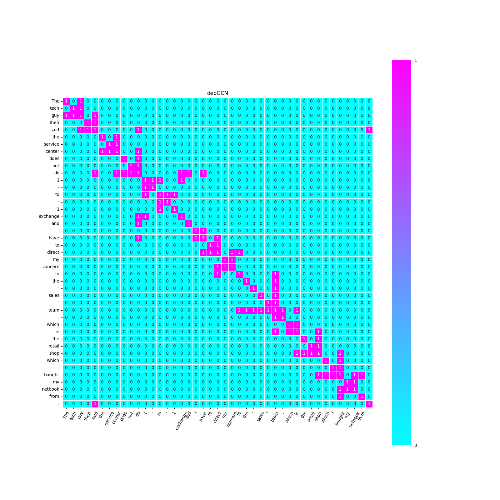
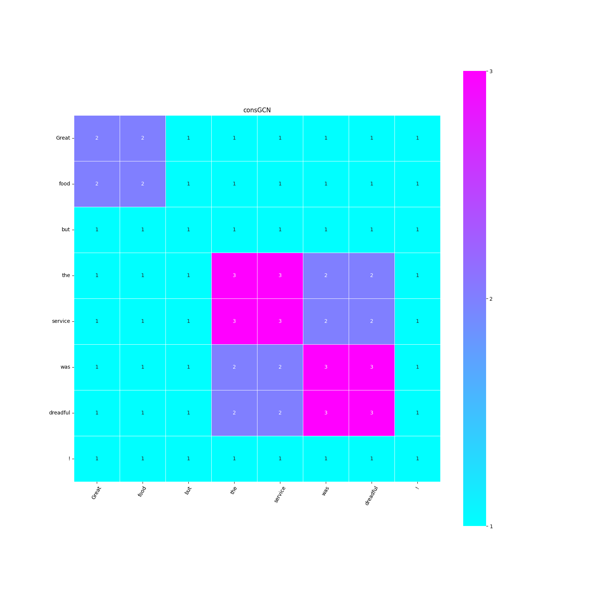
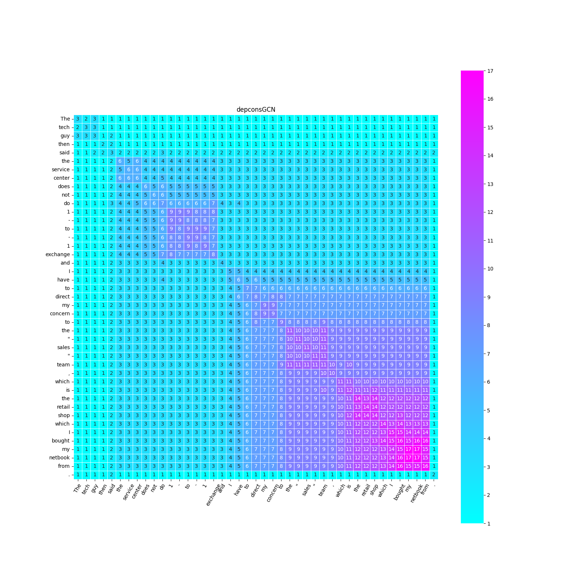

# AdjViz

A tool for visualizing adjacency matrices of graph neural networks

Based on dependency and constituency parsing tree

## Usage

### Step 1
run this code in the terminal
```
python app.py
```

### Step 2

Access http://127.0.0.1:5000 in your browser

### Step 3

write your text in **Input text** and click **submit**

## Example

Input text: Great food but the service was dreadful !






