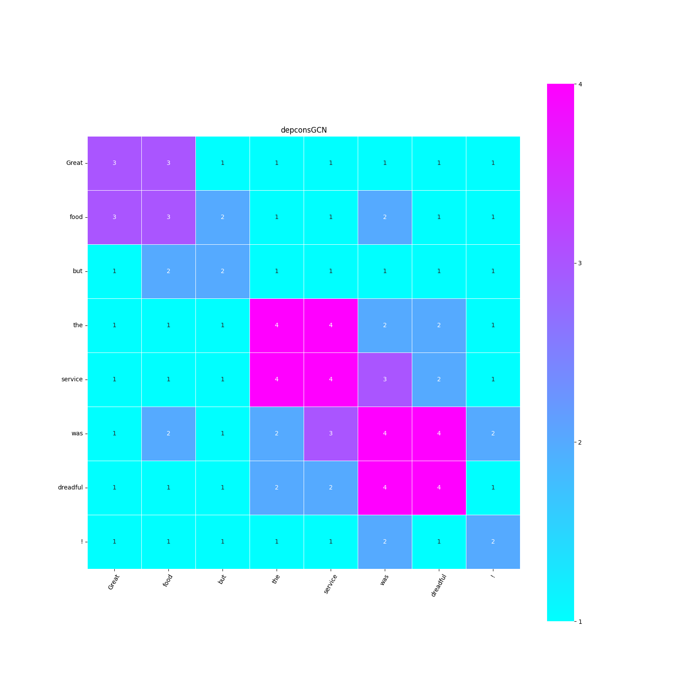

# AdjViz

A tool for visualizing adjacency matrices of graph neural networks

Based on dependency and constituency parsing tree

## Usage

### Step 1
create env
```
python3 -m venv venv
source venv/bin/activate
pip install -r requirements.txt
python -m spacy download en_core_web_md
```

### Step 2
run this code in the terminal
```
python app.py
```

### Step 3

Access http://127.0.0.1:5000 in your browser

### Step 4

write your text in **Input text** and click **submit**

## Example

Input text: Great food but the service was dreadful !



